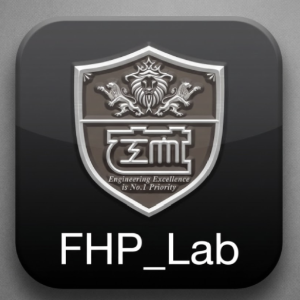

# StraightUp — AI 기반 실시간 거북목 자세 교정 앱

<p align="center">
  
</p>

> 한양대학교 공과대학 학술제 2025 출품작  
> **FHP Lab** 팀 프로젝트

## 프로젝트 소개

StraightUp은 스마트폰 카메라를 활용하여 사용자의 자세를 실시간으로 분석하고, **CVA(Craniovertebral Angle)** 를 측정하여 거북목(전방 머리 자세, FHP) 상태를 분류·피드백하는 Android 앱입니다.

### 핵심 기능

| 기능 | 설명 |
|------|------|
| 실시간 모니터링 | CameraX + MediaPipe Pose Landmarker로 자세 실시간 분석 |
| CVA 측정 | 귀-어깨 랜드마크 기반 Craniovertebral Angle 계산 |
| 자세 분류 | EfficientNet-B0 (TFLite) 모델로 Normal / Mild / Severe 3단계 분류 |
| 대시보드 | MPAndroidChart 기반 CVA 추이 차트 (오늘/주간/월간) |
| AI 피드백 | 상태별 맞춤 코칭 메시지 + Before/After 자세 비교 |
| 음성 알림 | TTS 기반 자세 교정 알림 (10초 간격) |

### CVA 분류 기준

| 상태 | CVA 범위 | 의미 |
|------|----------|------|
| Normal | ≥ 55° | 정상 자세 |
| Mild | 45° ~ 55° | 경미한 거북목 |
| Severe | < 45° | 심한 거북목 |


## 기술 스택

| 분류 | 기술 |
|------|------|
| 언어 | Java |
| 플랫폼 | Android (minSdk 24, targetSdk 34) |
| 자세 감지 | MediaPipe Pose Landmarker |
| 분류 모델 | TensorFlow Lite + EfficientNet-B0 |
| 카메라 | CameraX 1.3.4 |
| 백엔드 | Firebase Realtime Database + Anonymous Auth |
| 차트 | MPAndroidChart v3.1.0 |
| AI 피드백 | Google Generative AI (Gemini) — 현재 Mock 구현 |
| UI | Material Design 3, ViewBinding, Navigation Component |

## 앱 아키텍처

MVVM 패턴 기반 **Single Activity + Multi Fragment** 구조입니다.

```
MainActivity (Anonymous Auth + Navigation)
├── DashboardFragment   — CVA 추이 차트 (기본 화면)
├── CameraFragment      — 실시간 카메라 모니터링
├── FeedbackFragment    — AI 코칭 + Before/After 비교
└── SettingsFragment    — 알림/캡처/데이터 보관 설정
```

### 분석 파이프라인

```
카메라 프레임
  → PoseAnalyzer (MediaPipe 랜드마크 감지 + CVA 계산)
  → CameraViewModel (결과 처리 + Firebase 저장 + TTS 알림)
  → DashboardViewModel (EMA 스무딩 → 차트 렌더링)
  → FeedbackViewModel (상태별 코칭 메시지 생성)
```


## 프로젝트 구조

```
StraightUp/
├── app/
│   └── src/main/
│       ├── assets/
│       │   ├── EfficientNet-B0.tflite       # 거북목 분류 모델
│       │   └── pose_landmarker.task         # MediaPipe 자세 감지 모델
│       ├── java/.../straightup/
│       │   ├── MainActivity.java            # Single Activity, 익명 로그인
│       │   ├── PoseAnalyzer.java            # MediaPipe + TFLite 분석 파이프라인
│       │   ├── PostureCorrector.java        # BitmapMesh 워핑 자세 교정 시뮬레이션
│       │   ├── LandmarkOverlayView.java     # 랜드마크 오버레이 커스텀 뷰
│       │   ├── Camera*.java                 # 카메라 모니터링 (Fragment + ViewModel)
│       │   ├── Dashboard*.java              # 대시보드 차트 (Fragment + ViewModel)
│       │   ├── Feedback*.java               # AI 피드백 (Fragment + ViewModel)
│       │   ├── Settings*.java               # 설정 (Fragment + ViewModel)
│       │   └── *.java                       # 데이터 모델 (CvaDataPoint, AnalysisResult 등)
│       └── res/                             # 레이아웃, 네비게이션, 테마, 리소스
│
└── documents/                               # 학술제 프로젝트 자료
    ├── reports/                             # 과제 보고서
    ├── presentation/                        # 발표자료, 포스터, 대본
    ├── model/
    │   ├── straightup_model.tflite          # 학습된 모델 파일
    │   └── notebooks/                       # Jupyter 노트북 (모델링, 분석, 시각화)
    ├── dataset/
    │   ├── raw/                             # 자체 수집 원본 (Normal/Mild/Severe)
    │   └── augmented/                       # 증강 데이터셋
    └── data-collection/                     # 데이터 수집 도구 및 문서
```

## 빌드 및 실행

### 사전 요구사항

- Android Studio Hedgehog 이상
- JDK 8+
- Firebase 프로젝트 (Anonymous Auth + Realtime Database 활성화)

### 설정

1. 저장소 클론
   ```bash
   git clone https://github.com/<your-username>/StraightUp.git
   ```

2. Firebase 설정
   - Firebase Console에서 프로젝트 생성
   - `google-services.json`을 `app/` 디렉토리에 배치

3. (선택) Gemini API 키 설정
   ```properties
   # local.properties
   GEMINI_API_KEY=your_api_key_here
   ```

4. Android Studio에서 프로젝트 열기 → Sync → Run

## 라이선스

이 프로젝트는 [MIT License](LICENSE)를 따릅니다.

## 팀

**FHP Lab** — 한양대학교 공과대학 학술제 2025
